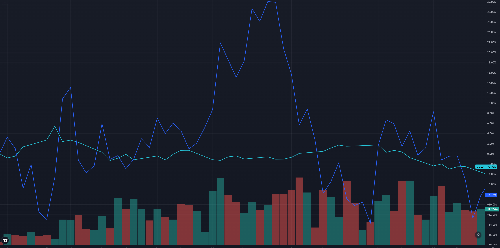
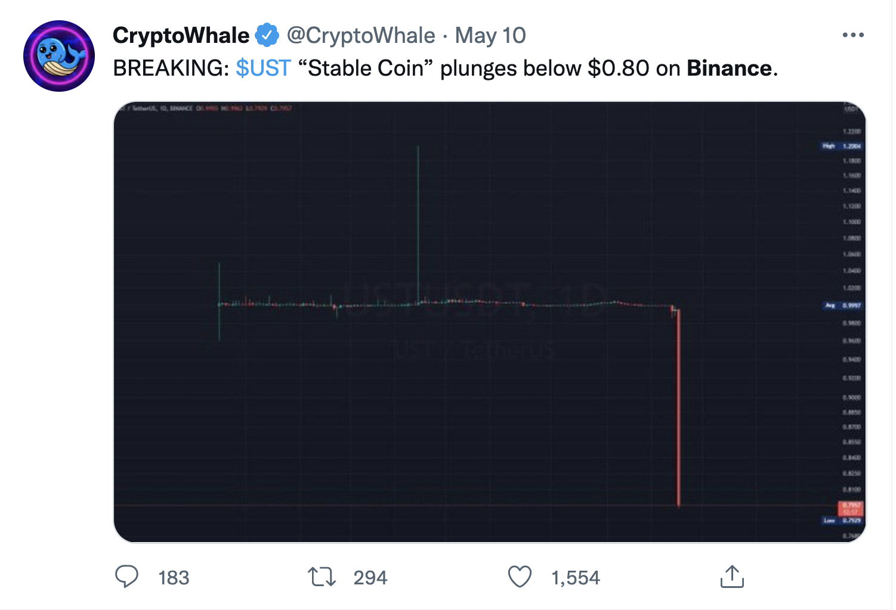

Preface
=======

If you're reading this, like me, you must strangely like the idea of
effectively designing peer to peer networks.

Almost no real world usage (unless you work in this industry), but
nevertheless the design is so interesting!

Peer to peer networks effectively are close approximations of how humans
interact. Much like how object orientated tried to represent how humans
think, I believe peer to peer networks are how humans communicate.

I mean, after all, you don't talk to a single person (server) who then
does everything for you (client). Well, unless you're in a Turing test!

This is what makes P2P interesting to me. When looking at the design of
P2P networks, we're looking at how humans communicate, how we build our
own interpersonal networks. How we can represent cities and the likes on
this network.

We'll start off with 2 of the biggest P2P networks. Tor and BitTorrent.
To understand how to design them, we've got to look at the best!

Although I won't talk about Bitcoin, or any cryptocurrency. There simply
is nothing for me to add. My favourite book on this topic is \"Mastering
Bitcoin\". Check it out!

Towards the end of this ebook, we'll look at designing effective P2P
networks. Taking what we saw in Tor and Bittorrent and some
cryptocurrency knowledge, we'll try to generalise a solution for
designing them.

After all, there is about 5,000,000 articles on designing good
client-server networks but almost none on peer to peer!

Let us begin!

Tor
===

The United States Naval Research Laboratory developed The Onion Routing
Protocol (T0r) to project U.S. intelligence communications online.
Ironically, Tor has seen widespread use by everyone - even those
organisations which the U.S. Navy fights against.

You may know Tor as the hometown of online illegal activities, a place
where you can buy any drug you want, a place for all things illegal. Tor
is much larger than what the media makes it out to be. According to
Kings College much of Tor is legal.

When you normally visit a website, your computer makes a direct TCP
connection with the website's server. Anyone monitoring your internet
could read the TCP packet. They can find out what website you're
visiting and your IP address. As well as what port you're connecting to.

If you're using HTTPS, no one will know what the message said. But,
sometimes all an adversary needs to know is who you're connecting to.

Using Tor, your computer never communicates with the server directly.
Tor creates a twisted path through 3 Tor nodes, and sends the data via
that circuit.

The core principle of Tor is onion routing which is a technique for
anonymous and secure communication over a public network. In onion
routing messages are encapsulated in several layers of encryption.

> \"Onions have layers\" - Shrek

So does a message going through Tor. Each layer in Tor is encryption,
you are adding layers of encryption to a Tor message, as opposed to just
adding 1 layer of encryption.

This is why it's called The Onion Routing Protocol, because it adds
layers at each stage.

The resulting onion (fully encapsulated message) is then transmitted
through a series of computers in a network (called onion routers) with
each computer peeling away a layer of the 'onion'. This series of
computers is called a path. Each layer contains the next destination -
the next router the packet has to go to. When the final layer is
decrypted you get the plaintext (non-encrypted message).

The original author remains anonymous because each node in the network
is only aware of the preceding and following nodes in the path (except
the first node that does know who the sender is, but doesn't know the
final destination).

This has led to attacks where large organisations with expansive
resources run servers to attempt to be the first and last nodes in the
network. If the organisation's server is the first node, it knows who
sent the message. If the organisation server is the last node, it knows
the final destination and what the message says.

Now we have a basic overview of Tor, let's start exploring how each part
of Tor works. Don't worry if you're confused, every part of Tor will be
explained using gnarly diagrams.

Overview of Tor
---------------

> \"Onion Routing is a distributed overlay network designed to anonymise
> TCP-based applications like web browsing, secure shell and instant
> messaging.\"

Clients choose a path through the network and build a circuit where each
onion router in the path knows the predecessor and the successor, but no
other nodes in the circuit. Paths and circuits are synonyms.
{width="\textwidth" height="\textheight"} The original
author (the question mark on the far left) remains anonymous, unless
you're the first path in the node as you know who sent you the packet.
{width="\textwidth" height="\textheight"} No one knows
what data is being sent until it reaches the last node in the path; who
knows the data but doesn't know who sent it. The second to last node in
the path doesn't know what the data is, only the last node in the path
does. {width="\textwidth" height="\textheight"} This has
led to attacks whereby large organisations with expansive resources
create Tor servers which aim to be the first and last onion routers in a
path. If the organisation can do this, they get to know who sent the
data and what data was sent, effectively breaking Tor.
{width="\textwidth" height="\textheight"} It's incredibly
hard to do this without being physically close to the location of the
organisations servers, we'll explore this more later.

Throughout this article I'll be using Netflix as a normal service (Bob)
and Amazon Prime Video as the adversary (Eve). In the real world, this
is incredibly unlikely to be the case. I'm not here to speculate on what
organisations might want to attack Tor, so I've used 2 unlikely examples
to avoid the political side of it.

Each packet flows down the network in fixed-size cells. These cells have
to be the same size so none of the data going through the Tor network
looks suspiciously big.

These cells are unwrapped by a symmetric key at each router and then the
cell is relayed further down the path. Let's go into Tor itself.

Tor Itself
----------

> \"There is strength in numbers\"

Tor needs a lot of users to create anonymity, if Tor was hard to use new
users wouldn't adopt it so quickly. Because new users won't adopt it,
Tor becomes less anonymous. By this reasoning it is easy to see that
usability isn't just a design choice of Tor but a *security requirement*
to make Tor secure.

If Tor isn't usable or designed nicely, it won't be used by many people.
If it's not used by many people, it's less anonymous.

Tor has had to make some design choices that may not improve security
but improve usability with the hopes that an improvement in usability is
an improvement in security.

### What Tor Isn't

Tor is not a completely decentralised peer-to-peer system like many
people believe it to be. If it was completely peer to peer it wouldn't
be very usable. Tor requires a set of directory servers that manage and
keep the state of the network at any given time.

Tor is not secure against end to end attacks. An end to end attack is
where an entity has control of both the first and last node in a path,
as talked about earlier. This is a problem that cyber security experts
have yet to solve, so Tor does not have a solution to this problem.

Tor does not hide the identity of the sender.

In 2013 during the Final Exams period at Harvard a student tried to
delay the exam by sending in a fake bomb threat. The student used Tor
and Guerrilla Mail (a service which allows people to make disposable
email addresses) to send the bomb threat to school officials.

The student was caught, even though he took precautions to make sure he
wasn't caught.

Gurillar mail sends an originating IP address header along with the
email that's sent so the receiver knows where the original email came
from. With Tor, the student expected the IP address to be scrambled but
the authorities knew it came from a Tor exit node (Tor keeps a list of
all nodes in the directory service) so the authorities simply looked for
people who were accessing Tor (within the university) at the time the
email was sent.

Tor isn't an anonymising service, but it is a service that can encrypt
all traffic from A to B (so long as an end-end attack isn't performed).
Tor is also incredibly slow, so using it for Netflix isn't a good use
case. {width="\textwidth" height="\textheight"}

### The Difference Between Tor and a VPN

When you use a VPN, the VPN forwards all your internet traffic to the
appropriate destination. When it does so, the VPN encrypts your traffic.
All your internet service provider can see is encrypted traffic heading
from your computer to the VPN. {width="\textwidth"
height="\textheight"} They can't see inside your packets. They don't
know who you're talking to - other than the VPN.

VPN's aren't private in the same way that Tor is. VPNs protect you
against ISPs or local adversaries (ones monitoring your laptop's WiFi).
But, they don't protect you from themselves.

The VPN is the man in the middle. It knows who you are and who you're
talking to. Depending on the traffic, the VPN also decrypts your packet.
Meaning they know everything. With a VPN, you have to trust it. With
Tor, you don't have to put a lot of trust in.

In Tor, one rogue node is survivable. If one of the nodes in our graph
earlier was an adversary, they'll only know our IP address or our data
packet. Tor protects you from Tor. VPN's expect that you trust them.

Tor protects you from the Tor network. One rogue node is survivable.
They don't expect you to trust the network.

No one, apart from you, should know the IP addresses of the origin and
destination - and know the contents of the message.

{width="\textwidth" height="\textheight"}

Now that we have a good handle on what Tor is, let's explore **onion
routing**.

Onion Routing
-------------

{width="\textwidth" height="\textheight"} Given the
network above, we are going to simulate what Tor does. Your computer is
the one on the far left, and you're sending a request to watch Stranger
Things on Netflix. This path of nodes is called a **circuit**. Later on,
we're going to look into how circuits are made and how the encryption
works. But for now we're trying to generalise how Tor works.
{width="\textwidth" height="\textheight"} We start off
with the message (we haven't sent it yet). We need to encrypt the
message N times (where N is how many nodes are in the path). We encrypt
it using AES, a symmetric key crypto-system. The key is agreed using
Diffie-Hellman. Don't worry, we'll discuss all of this later. There is 4
nodes in the path (minus your computer and Netflix) so we encrypt the
message 4 times. {width="\textwidth"
height="\textheight"} Our packet (onion) has 4 layers. Blue, purple,
orange, and teal. Each colour represents one layer of encryption.
{width="\textwidth" height="\textheight"} We send the
onion to the first node in our path. That node then removes the first
layer of encryption.

Each node in the path knows what the key to decrypt their layer is (via
Diffie-Hellman). Node 1 removes the blue layer with their symmetric key
(that you both agreed on). {width="\textwidth"
height="\textheight"} Node 1 knows you sent the message, but the message
is still encrypted by 3 layers of encryption, it has no idea what the
message is.

As it travels down the path, more and more layers are stripped away. The
next node does not know who sent the packet. All it knows is that Node 1
sent them the packet, and it's to be delivered to Node 3.
{width="\textwidth" height="\textheight"} Now Node 3
strips away a layer. {width="\textwidth"
height="\textheight"} The final node knows what the message is and where
it's going, but it doesn't know who sent it. All it knows is that Node 3
sent them the message, but it doesn't know about anyone else in the
path. One of the key properties here is that once a node decrypts a
layer, it cannot tell how many more layers there are to decrypt. It
could be as small as 1 or 2 or as large as 200 layers of encryption.
{width="\textwidth" height="\textheight"} Now there's no
way Amazon can find out you watch Netflix! Netflix sends back a part of
Stranger Things.

Let's see how it works in reverse. {width="\textwidth"
height="\textheight"} Node 4 adds its layer of encryption now. It
doesn't know who originally made the request, all it knows is that Node
3 sent the request to them so it sends the response message back to Node
3. {width="\textwidth" height="\textheight"} And so on
for the next few nodes. {width="\textwidth"
height="\textheight"} Now the response packet is fully encrypted.
{width="\textwidth" height="\textheight"} Now the packet
is fully encrypted, the only one who still knows what the message
contains is Node 4. The only one who knows who made the message is Node
1. Now that we have the fully encrypted response back, we can use all
the symmetric keys to decrypt it. {width="\textwidth"
height="\textheight"} You might be thinking \"I've seen snails �� faster
than this\" and you would be right. This protocol isn't designed for
speed, but at the same time it has to care about speed.

The algorithm could be much slower, but much more secure (using entirely
public key cryptography instead of symmetric key cryptography) but the
usability of the system matters. So yes, it's slow. No it's not as slow
as it could be. But it's all a balancing act here.

The encryption used is normally AES with the key being shared via
Diffie-Hellman.

The paths Tor creates are called circuits. Let's explore how Tor chooses
what nodes to use in a circuit.

How Is a Circuit Created?
-------------------------

Each machine, when it wants to create a circuit, chooses the exit node
first, followed by the other nodes in the circuit. Tor circuits are
always 3 nodes. Increasing the length of the circuit does not create
better anonymity. If an attacker owns the first and last nodes in the
network, you can have 1500 nodes in the circuit and it still wouldn't
make you more secure.

When Tor selects the exit node, it selects it following these
principles:

1.  Does the client's torrc (the configuration file of Tor) have
    settings about which exit nodes not to choose?

2.  Tor only chooses an exit relay which allows you to exit the Tor
    network. Some exit nodes only allow web traffic (HTTP/S port 80)
    which is not useful when someone wants to send email (SMTP port 25).
    The exit node has to have the available capacity to support you. Tor
    tries to choose an exit node which has enough resources available.

All paths in the circuit obey these rules:

-   We do not choose the same router twice for the same path.

If you choose the same node twice, it's guaranteed that the node will
either be the guard node (the node you enter at) or the exit node, both
dangerous positions. There is a 2/3 chance of it being both the guard
and exit nodes, which is even more dangerous. We want to avoid the entry
/ exit attacks. {width="\textwidth"
height="\textheight"}

-   We do not choose any router in the same family as another in the
    same path. (Two routers are in the same family if each one lists the
    other in the "family" entries of its descriptor.)

Operators who run more than 1 Tor node can choose to signify their nodes
as 'family'. This means that the nodes have all the same parent (the
operator of their network). This is again a countermeasure against the
entry / exit attacks, although operators do not have to declare family
if they wish. If they want to become a guard node (discussed soon) it is
recommended to declare family, although not required.
{width="\textwidth" height="\textheight"}

-   We do not choose more than one router in a given /16 subnet.

Subnets define networks. IP addresses are made up of 8 octets of bits.
As an example, Google's IP address in binary is:

python 01000000.11101001.10101001.01101010

The first 16 bits (the /16 subnet) is **01000000.11101001** which means
that Tor does not choose any nodes which start with the same 16 bits as
this IP address. Again, a counter-measure to the entry / exit attacks.
{width="\textwidth" height="\textheight"} If subnets
sound confusing, I've written this Python code to help explain them:

python \# ip addresses are in binary, not the usual base 10 subnets \#
are usually powers of 2, this is 2\^4. IP =
\"01000000.11101001.10101001.01101010\" subnet = 16

\# this will store the subnet address once we find it subnet\_ip = \[\]
IP\_list = list(IP) counter = 0

for i in IP\_list: \# we want to end the loop when we reach the subnet
number if counter \>= subnet: break \# the ip address segments each
oclet of bits with full stops \# we don't want to count a fullstop as a
number \# but we want to include it in the final subnet if i == \".\":
subnet\_ip.append(\".\") continue else: \# else it is a number so we
append and increment counter subnet\_ip.append(i) counter = counter + 1
print(\"Subnet is \" + ".join(subnet\_ip))

-   We don't choose any non-running or non-valid router unless we have
    been configured to do so. By default, we are configured to allow
    non-valid routers in "middle" and "rendezvous" positions.

Non-running means the node currently isn't online. You don't want to
pick things that aren't online. Non-valid means that some configuration
in the nodes **torrc** is wrong. You don't want to accept strange
configurations in case they are trying to hack or break something.

-   The first node must be a **Guard node**.

A **guard node** is a privileged node because it sees the real IP of the
user. It's 'expensive' to become a guard node (maintain a high uptime
for weeks and have good bandwidth). {width="\textwidth"
height="\textheight"} This is possible for large companies who have 99.9
percent uptime and high bandwidth (such as Netflix). Tor has no way to
stop a powerful adversary from registering a load of guard nodes. Right
now, Tor is configured to stick with a single guard node for 12 weeks at
a time, so you choose 4 new guard nodes a year.

This means that if you use Tor once to watch Amazon Prime Video, it is
relatively unlikely for Netflix to be your guard node. Of course, the
more guard nodes Netflix creates the more likely it is. Although, if
Netflix knows you are connecting to the Tor network to watch Amazon
Prime Video then they will have to wait 4 weeks for their suspicions to
be confirmed, unless they attack the guard node and take it over.

Becoming a guard node is relatively easy for a large organisation.
Becoming the exit node is slightly harder, but still possible. We have
to assume that the large organisation has infinite computational power
to be able to do this. The solution is to make the attack highly
expensive with a low rate of success. The more regular users of Tor, the
harder is if for a large organisation to attack it. If Netflix controls
$\frac{50}{100}$ nodes in the network:
{width="\textwidth" height="\textheight"} The chance of
you choosing a guard node from Netflix is 50

If suddenly 50 more normal user nodes join then that's $\frac{50}{100}$
reducing the probability of Netflix owning a guard node (and thus, a
potential attack) and making it even more expensive.
{width="\textwidth" height="\textheight"} There is
strength in numbers within the Tor service.

Guard Pinning
-------------

When a Tor client starts up for the first time, it chooses a small and
random set of guard nodes. For the next few months, it makes sure each
circuit is using one of these pre-selected nodes as its guard node.

The official proposal from the Tor documentation states:

> \"1. Introduction and motivation
>
> Tor uses entry guards to prevent an attacker who controls some a
> fraction of the network from observing a fraction of every user's
> traffic. If users chose their entries and exits uniformly at random
> from the list of servers every time they build a circuit, then an
> adversary who had (k/N) of the network would deanonymize $F=(k/N)^2$
> of all circuits\... and after a given user had built C circuits, the
> attacker would see them at least once with probability $1-(1-F)^C$.
> With large C, the attacker would get a sample of every user's traffic
> with probability 1.
>
> To prevent this from happening, Tor clients choose a small number of
> guard nodes (currently 3). These guard nodes are the only nodes that
> the client will connect to directly. If they are not compromised, the
> user's paths are not compromised.
>
> But attacks remain. Consider an attacker who can run a firewall
> between a target user and the Tor network, and make many of the guards
> they don't control appear to be unreachable. Or consider an attacker
> who can identify a user's guards, and mount denial-of-service attacks
> on them until the user picks a guard that the attacker controls.\"

Guard node pinning is important because of Tor's threat model. Tor
assumes that it may only take a single opening for an adversary to work
out who you are talking to, or who you are. Since a single vulnerability
circuit can destroy your integrity, Tor tries to minimise the
probability that we will ever construct one or more vulnerable circuits.

Tor guard nodes can be denial of service attacked, or an attacker could
have a majority share of guard nodes on the internet when you connect to
try and get you. By guard node pinning, it aims to make this much
harder.

In the event of an attacker working out your guard nodes and shutting
them down, forcing you to connect to their guard nodes. Or, you connect
to a guard node controlled by an adversary Tor has algorithms in place
to try and detect this.

What Is a Directory Node?
-------------------------

The state of the Tor network is tracked and publicised by a group of 9
trusted servers (as of 2019) known as **directory nodes**. Each of which
is controlled by a different organisation.

Each node is a separate organisation because it provides redundancy and
distributes trust. The integrity of the Tor network relies on the
honesty and correctness of the directory nodes. So making the network
resilient and distributing trust is critical.

Directory nodes maintain a list of currently running relays (publicly
listed node in the Tor network). Once per hour directory nodes publish a
consensus together. The consensus is a single document compiled and
voted on by each directory node. It ensures that all clients have the
same information about the relays that make up Tor.

When a Tor user (a client or a node) wants to know the current state of
the network, it asks a directory node. As we'll see later, directory
nodes are essential for all parts of Tor, especially in hidden services.
{width="\textwidth" height="\textheight"} Relays keep
the directory nodes up to date. They send directory node(s) a
notification whenever they come online or updated. Whenever a directory
node receives a notification, it updates its personal opinion on the
current state of the Tor network. All directory nodes then use this
opinion to form a consensus of the network.
{width="\textwidth" height="\textheight"} Let's now look
at what happens when disagreements arise in the directory services when
forming a consensus.

The first version of Tor took a simple approach to conflict resolution.
Each directory node gave the state of the network as it personally saw
it. Each client believed whichever directory node it had spoken to
recently. There is no consensus here among all directory nodes.

In Tor, this is a disaster. There was nothing ensuring that directory
nodes were telling the truth. If an adversary took over one directory
node, they would be able to lie about the state of the network.
{width="\textwidth" height="\textheight"} If a client
asked this adversary controlled directory for the state of the network,
it'd return a list. This list contains only nodes that the adversary
controlled. The client would then connect to these adversary nodes.

The second version of the Tor directory system made this attack harder.
Instead of asking a single directory node for its opinion, clients asked
every directory node and combined their opinions into a consensus. But,
clients could form differing views on the network depending on when they
had last spoken to each directory node. This gave way to statistical
information leakage - not as bad as Tor 1.0. Besides, every client had
to talk to every directory node, which took time and was expensive.

The third and current version of the directory system moved the
responsibility of calculating a consensus from clients to directory
nodes. {width="\textwidth" height="\textheight"}

What Are Bridge Nodes?
----------------------

I'm not sure if you saw it earlier, but I made the distinction between
nodes in the directory services and nodes that aren't.

If a repressive state wants to block Tor, it uses the directory nodes.
Directory nodes keep up-to-date lists of Tor relay nodes and are
publicly available for anyone to download.

The state can query a directory node for a list of active Tor relays,
and censor all traffic to them.

Tor keeps an up-to-date listing of countries where it is possibly
blocked (censored) if you're interested.

Tor helps its users circumvent the censorship by hiding the fact they
are using Tor. They do this through a proxy known as a Bridge Node. Tor
users send their traffic to the bridge node, which forwards the traffic
onto the user's chosen guard nodes. {width="\textwidth"
height="\textheight"} The full list of Bridge nodes is never published,
making it difficult for states to completely block Tor. You can view
some bridge nodes here. If this doesn't work, Tor suggests:

> \"Another way to get bridges is to send an email to
> bridges\@torproject.org. Please note that you must send the email
> using an address from one of the following email providers: Riseup or
> Gmail.

It's possible to block Tor another way. Censoring states can use Deep
Packet Inspection (DPI)to analyse the shape, volume, and feel of each
packet. Using DPI states can recognise Tor traffic, even when they
connect to unknown IP addresses or are encrypted.

To circumvent this, Tor developers have made Pluggable Transports (PT).
These transform Tor traffic flow between the client and the bridge. In
the words of Tor's documentation:

This way, censors who monitor traffic between the client and the bridge
will see innocent-looking transformed traffic instead of the actual Tor
traffic. External programs can talk to Tor clients and Tor bridges using
the pluggable transport API, to make it easier to build interoperable
programs.

Tor Hidden Services
-------------------

Ever heard those rumours \"there are websites on the dark-web, on Tor
that when you visit them you'll see people doing nasty things, selling
illegal things or worse: watching The Hangover Part 3\"

When people talk about these websites they are talking about **Tor
Hidden Services**.

These are a wild concept and honestly deserve an entire blogpost on
their own. Hidden services are servers, like any normal computer server.
{width="\textwidth" height="\textheight"} Except in a
Tor Hidden Service it is possible to communicate without the user and
server knowing who each other are. {width="\textwidth"
height="\textheight"} The device (the question mark) knows that it wants
to access Netflix, but it doesn't know anything about the server and the
server doesn't know anything about the device that's asked to access it.
This is quite confusing, but don't worry, I'm going to explain it all
with cool diagrams.

When a server is set up on Tor to act as a hidden service, the server
sends a message to some selected Onion Routers asking if they want to be
an introduction point to the server. It is entirely up to the server as
to who gets chosen as an introduction point, although usually they ask 3
routers to be their introduction points.
{width="\textwidth" height="\textheight"} The
introduction points know that they are going to be introducing people to
the server.

The server will then create something called a hidden service descriptor
which has a public key and the IP address of each introduction point. It
will then send this hidden service descriptor to a distributed hash
table which means that every onion router (not just the introduction
points) will hold some part of the information of the hidden service.

If you try to look up a hidden service the introduction point
responsible for it will give you the full hidden service descriptor, the
address of the hidden service's introduction points.

The key for this hash table is the onion address and the onion address
is derived from the public key of the server.

The idea is that the onion address isn't publicised over the whole Tor
network but instead you find it another way like from a friend telling
you or on the internet (addresses ending in .onion).

The way that the distributed hash table is programmed means that the
vast majority of the nodes won't know what the descriptor is for a given
key.

So almost every single onion router will have minimal knowledge about
the hidden service unless they explicitly want to find it.
{width="\textwidth" height="\textheight"} Let's say
someone gave you the onion address. You request the descriptor off the
hash table and you get back the services introduction points.

If you want to access an onion address you would first request the
descriptor from the hash table and the descriptor has, let's say 4 or 5
IP addresses of introductory nodes. You pick one at random let's say the
top one. {width="\textwidth" height="\textheight"}
You're going to ask the introduction point to introduce you to the
server and instead of making a connection directly to the server you
make a rendezvous point at random in the network from a given set of
Onion Routers. {width="\textwidth" height="\textheight"}
You then make a circuit to that rendezvous point and you send a message
to the rendezvous point asking if it can introduce you to the server
using the introduction point you just used. You then send the rendezvous
point a one time password (in this example, let's use 'Labrador').

The rendezvous point makes a circuit to the introduction point and sends
it the word 'Labrador' and its IP address.
{width="\textwidth" height="\textheight"} The
introduction point sends the message to the server and the server can
choose to accept it or do nothing. {width="\textwidth"
height="\textheight"} If the server accepts the message it will then
create a circuit to the rendezvous point.
{width="\textwidth" height="\textheight"} The server
sends the rendezvous point a message. The rendezvous point looks at both
messages from your computer and the server. It says \"well, I've
received a message from this computer saying it wants to connect with
this service and I've also received a message from the service asking if
it can connect to a computer, therefore they must want to talk to each
other\".

The rendezvous point will then act as another hop on the circuit and
connect them. {width="\textwidth" height="\textheight"}
In short, a hidden service works like this, taken from here:

1.  A hidden service calculates its key pair (private and public key,
    asymmetric encryption).

2.  Then the hidden service picks some relays as its introduction
    points.

3.  It tells its public key to those introduction points over Tor
    circuits.

4.  After that the hidden-service creates a hidden service descriptor,
    containing its public key and what its introduction points are.

5.  The hidden service signs the hidden service descriptor with its
    private key.

6.  It then uploads the hidden service descriptor to a distributed hash
    table (DHT).

7.  Clients learn the .onion address from a hidden service out-of-band.
    (e.g. public website) (A hash.onion is a 16 character name derived
    from the service's public key.)

8.  After retrieving the .onion address the client connects to the DHT
    and asks for that hash.

9.  If it exists the client learns about the hidden service's public key
    and its introduction points.

10. The client picks a relay at random to build a circuit to it, to tell
    it a one-time secret. The picked relay acts as rendezvous point.

11. The client creates a introduce message, containing the address of
    the rendezvous point and the one-time secret, before encrypting the
    message with the hidden service's public key.

12. The client sends its message over a Tor circuit to one of the
    introduction points, demanding it to be forwarded to the hidden
    service.

13. The hidden service decrypts the introduce message with its private
    key to learn about the rendezvous point and the one-time secret.

14. The hidden service creates a rendezvous message, containing the
    one-time secret and sends it over a circuit to the rendezvous point.

15. The rendezvous point tells the client that a connection was
    established.

16. Client and hidden service talk to each other over this rendezvous
    point. All traffic is end-to-end encrypted and the rendezvous point
    just relays it back and forth. Note that each of them, client and
    hidden service, build a circuit to the rendezvous point; at three
    hops per circuit this makes six hops in total.

Attacks on Tor
--------------

Tor projects its users from analysis attacks. The adversary wants to
know who Alice is talking to. Yet, Tor does not protect against
confirmation attacks. In these attacks, the adversary aims to answers
the question "Is Alice talking to Bob?"

Confirmation attacks are hard and need a lot of preparation and
resources. The attacker needs to be able to track both ends of the
circuit. The attacker can either directly track each devices internet
connection or the guard and exit nodes.

If Alice sends a packet like this:

python \# (timestamp, size, port, protocol) (17284812, 3, 21, SSH)

And Bob receives this packet, the attacker can see that the packets are
the same - even though the attacker cannot see what the packet is as it
is encrypted. Does Bob tend to receive packets at the same time that
Alice sends them? Are they the same size? If so, it is reasonable to
infer that Alice and Bob are communicating with each other.

Tor breaks packets up into sizeable chunks for a reason - to try and
prevent this kind of thing. Tor is working on padding all packets to
make this harder.

They're discussing adding packet order randomisation too. But this is
too costly at the moment. The Tor browser does add some extra defences,
such as reordering packets.

If Alice sends the packets, A, B, C and Bob receives them in B, A, C it
is harder to detect that they are the same. It's not foolproof, but it
does become harder.

An attack where the attacker tries to control both ends of the circuit
is called a Sylbil Attack. Named after the main character of the book
Sybil by Flora Rheta Schreiber. We discussed some of this earlier, where
an attacker controls both the guard and exit nodes.

Sybil attacks are not theoretical. In 2014 researchers at Carnegie
Mellon University appeared to successfully carry out a Sybil Attack
against the real-life Tor network.

When Lizard Squad - a group of hackers tried to perform a Sybil attack,
a detection system alarmed. Tor has built-in monitoring against these
kinds of events, and they are working on more sophisticated monitoring
against Sybil attacks.

In 2007 Dan Egerstad - a Swedish security consultant, revealed he has
intercepted usernames and passwords sent through Tor by being an exit
node. At the time, these were not TLS or SSL encrypted.

Interestingly, Dan Egerstad had this to say on the Tor nodes:

> \"If you actually look into where these Tor nodes are hosted and how
> big they are, some of these nodes cost thousands of dollars each month
> just to host because they're using lots of bandwidth, they're
> heavy-duty servers and so on. Who would pay for this and be
> anonymous?\"

Tor does not normally hide the fact that you are using Tor. Many
websites (such as BBC'S iPlayer or editing Wikipedia) block you when
using a known Tor node.

Some applications, under Tor, reveal your true IP address. One such
application is BitTorrent.

Jansen et al described an attack where they DDOS exit nodes. By
degrading the network (removing exit nodes) an attacker increases the
chance to getting an exit node.

Tor users who visit a site twice, once on Tor and once off, can be
tracked. The way you move your mouse is unique. There is a JavaScript
time measurement bug report on the Tor project that shows how it's
possible to monitor the mouse locations on a site (even when on Tor).
Once you fingerprint someone twice, you know they're the same person.

It should be noted, that Tor browser offers 3 levels of security
(located in the settings). The highest security level disables
JavaScript, some images (as they can be used to track you) and some
fonts too. The lesson is, if you want high-security Tor, use the
high-security version.

Now, all these attacks sound cool. But that's not how most Tor users are
caught. Most Tor users make mistakes and are caught because of
themselves.

Take Dredd pirate Roberts, Founder of the Silk Road dark marketplace. He
gave himself away by posting about it on social media.

Most Tor users are caught (if they're doing illegal things) by bad
operational security, and not normally because of a security issue with
Tor.

It's worth repeating this story, that we saw earlier.

In 2013 during the Final Exams period at Harvard, a student tried to
delay the exam by sending in a fake bomb threat. The student used Tor
and Guerrilla Mail (a service which allows people to make disposable
email addresses) to send the bomb threat to school officials.

The student was caught, even though he took precautions to make sure he
wasn't caught.

Guerilla mail sends an originating IP address header along with the
email that's sent to the receiver, so it knows where the original email
came from. With Tor, the student expected the IP address to be scrambled
but the authorities knew it came from a Tor exit node (Tor keeps a list
of all nodes in the directory service) so the authorities looked for
people who were accessing Tor (within the university) at the time the
email was sent.

If this person went to a coffee shop or something, he probably would of
be fine.

There's a fantastic talk at DEFCON 22 about how Tor users got caught.
None of the stories mentioned was caused by Tor, but rather bad OpSec.

Conclusion
----------

Tor is a fascinating protocol full of algorithms that have been refined
over the years. I've come to appreciate Tor, and I hope you have to.

BitTorrent
==========

BitTorrent is one of the most common protocols for transferring large
files. In February 2013, BitTorrent was responsible for 3.35 percent of
all worldwide bandwidth, more than half of the 6 percent of total
bandwidth dedicated to file sharing.

Who Created BitTorrent?
-----------------------

Bram Cohen invented the BitTorrent protocol in 2001. Cohen wrote the
first client implementation in Python.

Cohen collected free pornography to lure beta testers to use BitTorrent
in the summer of 2002.

BitTorrent vs Cient-Server Downloading
--------------------------------------

In traditional downloading, the server uploads the file, and the client
downloads the file. {width="\textwidth"
height="\textheight"} For popular files, this isn't very effective.

500 people downloading the same file will put the server under strain.
This strain will cap the upload speed, so clients can not download the
file fast.

Second, client-server costs a lot of money. The amount we pay increases
with how popular a file is.

Third, it's centralised. Say the system dies, the file no longer exists
- no one can download it.

BitTorrent aims to solve these problems.
{width="\textwidth" height="\textheight"} In a
peer-to-peer network, every peer is connected to every other peer in the
network. {width="\textwidth" height="\textheight"}
**Semi-centralised peer-to-peer networks** possess one or more peers
with higher authority than most peers.
{width="\textwidth" height="\textheight"}

High Level Overview
-------------------

BitTorrent is a way to share files. It's often used for large files.
BitTorrent is an alternative to a single source sharing a file, such as
a server. BitTorrent can productively work on lower bandwidth.

The first release of the BitTorrent client had no search engine and no
peer exchange, users who wanted to upload a file had to create a small
**torrent descriptor file** that they would upload to a torrent index
site.

When a user wants to share a file, they seed their file. This user is
called a seeder. They upload a torrent descriptor file to an exchange
(we'll talk about this later). Anyone who wants to download that file
will download this torrent descriptor.
{width="\textwidth" height="\textheight"} We call those
who download peers. Their torrent client will connect to a tracker
(discussed later) and the tracker will send them a list of IP addresses
of other seeds and peers in the swarm. The swarm is all PC's related to
a certain torrent.

The torrent descriptor file contains a list of trackers and metadata on
the file we're downloading. {width="\textwidth"
height="\textheight"} A peer will connect to a seed and download parts
of the file. {width="\textwidth" height="\textheight"}
Once the peer completes a download, they could function as a seed.
Although, it is possible to function as a seed while also downloading
(and is very common).

Once the seed has shared the file to a peer, that peer will act as a
seed. Instead of the client-server model where only 1 server exists to
upload the file, in BitTorrent, multiple people can upload the same
file.

BitTorrent splits the file up into chunks called pieces, each of a
certain size. Sometimes it's 256KB, sometimes it's 1MB. As each peer
receives a piece, they become a seed of that piece for other peers.

With BitTorrent, we do not have a single source to download from. We
could download a few pieces from your home country, then download a few
that your home country doesn't own from a far-away country.

The protocol hashes the pieces to make sure no seed has tampered with
the original file. Then stores the hash in the torrent descriptor on the
tracker.

This is how BitTorrent works at a very high level. We will now go into
detail. We aim to answer these questions:

1.  What if a peer only downloads and never uploads?

2.  Who do we download from, or upload to?

3.  What is a magnet link?

4.  What is a torrent descriptor?

5.  What hashing algorithm is used?

6.  How does BitTorrent selects what pieces to download?

And much more.

What's in a Torrent Descriptor File, Anyway?
--------------------------------------------

It's a dictionary (or hashmap) file.

The file is described as:

1.  **Announce**

The URL of the tracker. Remember earlier when we contacted the tracker
server to find other peers using the same file? We found that tracker by
using the announce key in the torrent descriptor file.

1.  **Info**

This maps to a dictionary whose keys depend on whether one or more files
are being shared. The keys are: **Files (child of info, is a list)**
Files only exists when multiple files are being shared. Files is a list
of dictionaries. Each dictionary corresponding to a file.

Each of these dictionaries has 2 keys:

**Length** - the size of the file in bytes. **Path** - A list of strings
corresponding to subdirectory names, the last of which is the actual
file name.

1.  **Length**

The size of the file in bytes (only when one file is being shared)

1.  **Name**

Suggested filename. Or the suggested directory name.

1.  **Pieces length**

The number of bytes per piece.

The piece's length must be a power of two and at least 16KiB.

This is: $$2^8 \; KiB = 256 \; KiB = 262,144 \; B$$

1.  **Pieces**

A hash list.

A list of hashes calculated on various chunks of data. We split the data
into pieces. Calculate the hashes for those pieces, store them in a
list.

BitTorrent uses SHA-1, which returns a 160-bit hash. Pieces will be a
string whose length is a multiple of 20 bytes.

If the torrent contains multiple files, the pieces are formed by
concatenating the files in the order they appear in the files directory.

All pieces in the torrent are the full piece length except for the last
piece which may be shorter.

Now, I can guess what you're thinking.

> \"SHA-1? What is this? The early 2000s?\"

And I agree.BitTorrent is moving from SHA-1 to SHA256. Google BEP 0052
to find out more.

Still confused? Not to worry! I designed this JSON file that describes
what a torrent file looks like. Note: I've concatenated some things.
This makes it easier to read and understand the general layout. I made
the numbers up, following the rules of BitTorrent's torrent descriptor.

python \"Announce\": \"url of tracker\", \"Info\": \"Files\": \[
\"Length\": 16, \"path\": \"/folder/to/path\" , \"length\": 193,
\"path\": \"/another/folder\" \] , \"length\": 192, \"name\":\"
Ubuntu.iso\", \"Pieces length\": 262144, \"Pieces\":
\[AAF4C61DDCC5E8A2DABEDE0F3B482CD9AEA9434D,
CFEA2496442C091FDDD1BA215D62A69EC34E94D0\]

The Piece Selection Algorithm of BitTorrent
-------------------------------------------

One of the largest questions in BitTorrent is "what pieces should I
select to download?"

With a traditional client-server model, we download the whole file. But
now, we get to pick what pieces to download.

The idea is to download the pieces that no one else has - the rare
pieces. By downloading the rare pieces, we make them less rare by
uploading them.

### What Are Sub-Pieces and the Piece Selection Algorithm?

BitTorrent uses TCP, a transmission protocol for packets. TCP has a
mechanism called slow start.

Slow start is a mechanism which balances the speed of a TCP network
connection. It escalates the amount of data transmitted until it finds
the network's maximum carrying capacity. **cwdn** stands for the
Congestion Window. {width="\textwidth"
height="\textheight"} TCP does this because if we send 16 connections at
once, the server may not be used to the traffic and congestion will
happen on the network.

If we're not regularly sending data, TCP may cap our network connection
at a slower speed than normal.

BitTorrent makes sure to always send data by breaking pieces down into
further sub-pieces.

Each sub-piece is about 16KB in size. The size for a piece is not fixed,
but it is somewhere around 1MB.

The protocol always has some number of requests (five) for a sub-piece
pipe-lined. When a new sub-piece is download, the client sends a new
request. This helps speed things up. {width="\textwidth"
height="\textheight"} Sub-pieces can be downloaded from other peers.

Two core policies govern the Piece Selection Algorithm.

**1. Strict Policy** Once the BitTorrent client requests a sub-piece of
a piece, any remaining sub-pieces of that piece are requested before any
sub-pieces from other pieces. {width="\textwidth"
height="\textheight"} In this image, it makes sense to download all the
sub-pieces of this piece first rather than start downloading another
piece.

**2. Rarest First** The main policy in BitTorrent is to pick the rarest
first. We want to download the piece which the fewest other peers own.

This is so we can make it 'un-rare'. If only one peer has a piece and
they go offline, no one will get the complete file.

A plethora of benefits exist for this policy.

-   **Growing the seed**

    Rarest first makes sure that we download only new pieces from the
    seed.

    The seed will begin as a bottleneck. The one peer with the file.

    A downloader can see what pieces their peers possess, and the rarest
    first policy will cause us to fetch the pieces from the seed which
    have not been uploaded by other peers.

    Let's visualise this. {width="\textwidth"
    height="\textheight"} The list of nodes (peers) is inter-connected.
    I cannot draw this as the diagram is unfavourable.

    Each arrow towards a sub-piece what that peer has downloaded. We
    downloaded a sub-piece that no one else has other than the seed.
    This means this sub-piece is rare.

    Our upload rate is higher than that of the seed, so all peers will
    want to download from us. Also, they would want to download the
    rarest pieces first, and as we are one of 2 holders of the rarest
    piece.

    When everyone downloads from us, we can download faster from them.
    This is the tit-for-tat algorithm (discussed later).

-   Increased download speed The more peers that hold the piece, the
    faster the download can happen. This is because we can download
    sub-pieces from other peers.

-   Enable uploading A rare piece is most wanted by other peers and
    getting a rare piece means peers will be interested in uploading
    from us. As we will see later, the more we upload, the more we can
    download.

-   Most common last It is sensible to leave the most common pieces to
    the end of the download. As many peers hold common pieces, the
    probability of being able to download them is much larger than that
    of rare pieces.

-   Prevent rarest piece missing When the seed dies, all the different
    pieces of the file should be distributed somewhere among the
    remaining peers.

**3. Random First Piece** Once we download, we have nothing to upload.
We need the first piece, fast. The rarest first policy is slow. Rare
pieces are downloaded slower because we can download its sub-pieces from
only a few peers.

**4. Endgame Mode** Sometime's a peer with a slow transfer rate will try
to give us a sub-piece. Causing a delay of the download. To prevent
this, there is "endgame mode".

Remember the pipe-lining principle? There are always several requests
for sub-pieces pending.

Assume we are downloading from 2 peers, and there is 1 other peer we are
not downloading from. {width="\textwidth"
height="\textheight"} When all the sub-pieces a peer lacks are
requested, they broadcast this request to all peers. This helps us get
the last chunk of the file. {width="\textwidth"
height="\textheight"} If a peer has the missing sub-piece, they will
send that back to our computer.

Once a sub-piece arrives, we send a cancel-message telling the other
peers to ignore our request. {width="\textwidth"
height="\textheight"}

### Resource Allocation Using Tit-For-Tat

No centralised resource allocation in BitTorrent exists. Instead, every
peer maximises their download rate.

A peer will download from whoever they can. To decide who to upload to,
they will use a variant of the \"tit-for-tat\"algorithm.

The tit-for-tat strategy comes from game theory. The essence is:

> \"Do onto others as they do onto you\"

1.  On the first move, cooperate.

2.  On each succeeding move do what your opponent did the previous move.

3.  Be prepared to forgive after carrying out just one act of
    retaliation.

### The Choking Algorithm

Choking is a temporary refusal to upload to another peer, but we can
still download from them.

To cooperate peers upload, and to not cooperate they "choke" the
connection to their peers. The principle is to upload to peers who have
uploaded to us. {width="\textwidth"
height="\textheight"} We want several bidirectional connections at the
same time and to achieve **Pareto Efficiency**.

> \"We consider an allocation Pareto Efficient if there is no other
> allocation in which some individual is better off and no individual is
> worse off.\"

Thus the big question, is how to determine which peers to choke and
which to unchoke?

A peer always unchokes a fixed number of its peers (the default is 4).

Current download rates decide which peers to unchoke. We use a 20-second
average to decide this. Because of the use of TCP (slow-start) rapidly
choking and unchoking is bad. Thus, this is calculated every 10 seconds.

If our upload rate is high more peers will allow us to download from
them. **This means that we can get a higher download rate if we are a
good uploader.** This is the most important feature of the BitTorrent
protocol.

The protocol prohibits many "free riders" which are peers who only
download and don't upload.

For a peer-to-peer network to be efficient, all peers need to contribute
to the network.

### Optimistic Unchoking

BitTorrent also allows an additional unchoked peer, where the download
rate criteria aren't used.

We call this optimistic unchoking. Checking unused connections aren't
better than the ones in use.

We shift the optimistic unchoke every 30 seconds. Enough time for the
upload reaches full speed. Same for the upload. If this new connection
turns out to be better than one of the existing unchoked connections, it
will replace it.

The optimistic unchoke is randomly selected.

This also allows peers who do not upload and only download to download
the file, even if they refuse to cooperate. Albeit, they will download
at a much slower speed.

### Anti-Snubbing

What happens if all peers uploading to another peer decide to choke it?
We then have to find new peers, but the optimistic unchoking mechanism
only checks one unused connection every 30 seconds. To help the download
rate recover more, BitTorrent has snubbing.

If a client hasn't received anything from a particular peer for 60
seconds, it will presume that it has been 'snubbed'.

Following the mentality of tit-for-tat, we retaliate and refuse to
upload to that peer (except if they become an optimistic unchoke).

The peer will then increase the number of optimistic unchokes to find
new connections quicker.

### What if we only upload?

We see that using the choking algorithm implemented in BitTorrent we
favour peers who are kind to us. If I can download fast from them, we
allow them to upload fast from me.

What about no downloads? Then it's impossible to know which peers to
unchoke using this choking algorithm. When a download is completed, we
use a new choking algorithm.

This new choking algorithm unchokes peers with the highest upload rate.
This ensures that pieces get uploaded faster, and they get replicated
faster.

Peers with good upload rates are also not being served by others.

What Is a Tracker?
------------------

Trackers are special types of server that help in communication between
peers.

Communication in BitTorrent is important. How do we learn what other
peers exist?

The tracker knows who owns the file, and how much.

Once a peer-to-peer download has started, communication can continue
without a tracker.

Since the creation of the distributed hash table method for trackerless
torrents, BitTorrent trackers are largely redundant.

### Public Trackers

These are trackers that anyone can use.

The Pirate Bay operated one of the most popular public trackers until
disabling it in 2009, opting only for magnet links (discussed soon).

Private trackers are private. They restrict use by requiring users to
register with the site. The method for controlling registration is often
an invitation system. To use this tracker we need an invitation.

### Multi-Tracker Torrents

Multi-tracker torrents contain multiple trackers in a single torrent
file. This provides redundancy if one tracker fails, the other trackers
can continue to maintain the swarm for the torrent.

With this configuration, it is possible to have multiple unconnected
swarms for a single torrent - which is bad. Some users can connect to
one specific tracker while being unable to connect to another. This can
create a disjoint set which can impede the efficiency of a torrent to
transfer the files it describes.

Magnet Links - Trackerless Torrents
-----------------------------------

Earlier, I talked about how the Pirate Bay got rid of trackers and
started using trackerless torrents.

When we download a torrent, we get a hash of that torrent. To download
the torrent without a tracker, we need to find other peers also
downloading the torrent. To do this, we need to use a distributed hash
table.

Let's explore Distributed Hash Tables.

### Distributed Hash Tables

Distributed Hash Tables (DHT) give us a dictionary-like interface, but
the nodes are distributed across a network. The trick with DHTs is that
the node that gets to store a particular key is found by hashing that
key.

In effect, each peer becomes a mini-tracker.

Each node (client/server implementing the DHT protocol) has a unique
identifier known as the "node ID". We choose node IDs at random from the
same 160-bit space as BitTorrent infohashes.

Infohashes are a SHA-1 hash of:

-   ITEM: length(size) and path (path with filename)

-   Name: The name to search for

-   Piece length: The length(size) of a single piece

-   Pieces: SHA-1 Hash of EVERY piece of this torrent

-   Private: flag for restricted access

We use a distance metric to compare two node IDs or a node ID and an
infohash for "closeness".

Nodes must have a routing table containing the contact information for a
few other nodes.

Nodes know about each other in the DHT. They know many nodes with IDs
that are close to their own but few with far-away IDs.

The distance metric is XOR and is interpreted as an integer.
$$distance(A, B) = |A \oplus B |$$ Smaller values are closer.

When a node wants to find peers for a torrent, they use the distance
metric to compare the infohash of the torrent with the IDs of the nodes
in its routing table or the ID of one node with the ID of another node.

Then they contact the nodes in the routing table closet to the infohash
and asks them for contact information of peers downloading the torrent.

If a contacted node knows about peers for the torrent, they return the
peer contact information with the response. Otherwise, the contacted
node must respond with the contact information of the nodes in its
routing table closet to the infohash of the torrent.
{width="\textwidth" height="\textheight"} The original
node queries nodes that are closer to the target infohash until it
cannot find any closer nodes. After the node exhausts the search, the
client then inserts the peer contact information for itself onto the
responding nodes with IDs closest to the infohash of the torrent. In the
future, other nodes can easily find us.

The return value for a query for peers includes an opaque value known as
the "token." For a node to announce that its controlling peer is
downloading a torrent, it must present the token received from the same
queried node in a recent query for peers.

When a node attempts to "announce" a torrent, the queried node checks
the token against the querying node's IP address. This is to prevent
malicious hosts from signing up other hosts for torrents.

The querying node returns the token to the same node that they receive
the token from. We must accept tokens for a reasonable amount of time
after they have been distributed. The BitTorrent implementation uses the
SHA-1 hash of the IP address concatenated onto a secret that changes
every five minutes and tokens up to ten minutes old are accepted.

Routing Table
-------------

Every node maintains a routing table of known good nodes. We use the
routing table starting points for queries in the DHT. We return nodes
from the routing table in response to queries from other nodes.

Not all nodes we learn about are equal. Some are "good" and some are
not. Many nodes using the DHT can send queries and receive responses,
but cannot respond to queries from other nodes. Each node's routing
table must contain only known good nodes.

A good node is a node has responded to one of our queries within the
last 15 minutes. A node is also good if it has ever responded to our
queries and has sent us a query within the last 15 minutes. After 15
minutes of inactivity, a node becomes questionable. Nodes become bad
when they fail to respond to multiple queries in a row. Nodes that we
see are good are given priority over nodes with an unknown status.
{width="\textwidth" height="\textheight"} The routing
table covers the entire node ID space from 0 to $2^160$. We subdivide
the routing table into "buckets" that each cover a portion of the space.

An empty table has one bucket with an ID space range of min=0,
max=$2^160$.

An empty table has only one bucket so any node must fit within it. Each
bucket can only hold K nodes, currently eight, before becoming "full."

When a bucket is full of known good nodes, we may add no more nodes
unless our node ID falls within the range of the bucket. The bucket is
replaced by two buckets each with half of the old bucket. Nodes from the
old bucket are distributed among the new buckets.

For a new table with only one bucket, we always split the full bucket
into two new buckets covering the ranges 0..$2^159$ and $2^159..2^160$.

When the bucket is full of good nodes, we simply discard the new node.
When nodes in the bucket become bad (if they do) we replace them with a
new node.

When nodes are considered questionable and haven't been since, in the
last 15 minutes, the least recently seen node is pinged. The node either
responds or doesn't respond. A response means we move to the next node.
We do this until we find a node that fails to respond. If we don't find
any, then the bucket is considered good.

When we do find one, we try one more time before discarding the node and
replacing them with a new good node.

Each bucket should maintain a "last changed" property to show how
"fresh" the contents are.

When a node in a bucket is pinged and responds, or a node is added to a
bucket, or a node is replaced with another node, the bucket's last
changed property is updated.

Buckets are refreshed if the last changed property has not been updated
in the last 15 minutes.

Attacks on BitTorrent
---------------------

Few attacks on the BitTorrent network exist. Everything is public. Our
IP address, what we're downloading - everything. Why attack an open
network?

Why attack a completely open network?

Only 7 entries are listed on Exploit-DB - a database of known exploits
against a service. And most of them relate to specific clients.

The principal attack on the BitTorrent network is to stop piracy. We've
gone this far without talking about piracy, but it is often synonymous
with BitTorrent.

The main attack on BitTorrent is Torrent Poisoning. This attack aims to
get the IP addresses of peers pirating content or to poison the content
in some way.

Madonna's American Life album release is an example of content
poisoning. Before the release, tracks were released of similar length
and file size. The tracks featured a clip of Madonna saying:

> \"What the fuck do you think you're doing?\"

Followed by a few minutes of silence.

Here are some methods of poisoning a torrent:

-   Index Poisoning The index allows users to locate the IP addresses of
    peers with the desired content. This method of attack makes
    searching for peers difficult.

    The attacker inserts a large amount of invalid information into the
    index to prevent users from finding the correct information.

    The idea is to slow down the download, by having the peer try to
    download pieces from an invalid peer.

-   Decoy Insertion They insert corrupted versions of a file into the
    network.

    Imagine 500 copies of a file and only 2 of them being the real file,
    this deters pirates from finding the real file.

    Most websites with lists of torrents a voting system. This deters
    this attack, as the top of searches is filled with non-corrupted
    files However, most websites with lists of torrents a voting

    This deters this attack, as the top of searches is filled with
    non-corrupted files.

    In GameDevTycoon, the file was released before the initial upload to
    piracy sites. Unbeknownst to pirates, the file was corrupted.
    Winning the game is impossible in the pirated version. Everything
    else was perfect.

### Defence Against the Dark Bittorrent Attack

Most popular torrents are released by individuals or groups who built up
a rapport over many years. On private trackers, individuals can be
pointed to. Poisoned torrents are quickly labelled and the poster can be
banned.

Or, on public trackers, downloading torrents made by trusted groups is
preferable. After all, would you prefer to download Ubuntu from the
Ubuntu team, or the user xxx-HACKER-ELITE-GHOST-PROTOCOL-xxx?

On public trackers, if a torrent is poisoned the torrent is reported and
removed.

The simplest way to defend against a BitTorrent attack is to use an IP
address not associated with you. Whether this is through a VPN or some
other service.

Conclusion
----------

And we are done with BitTorrent! Here are some things you may choose to
do:

-   Build your own BitTorrent client

-   Explore BitTorrent's proposals (BEPs) to learn more about how it
    works, and what's next for the algorithm

-   Read the official BitTorrent specification

Designing Effective Peer to Peer Networks
=========================================

By the end of the chapter, we should have a good understanding of the
important questions to answer when designing effective P2P networks.

When Should I Use a Peer to Peer Network?
-----------------------------------------

P2P networks can be used for all networking. We need to use the right
tool for the job.

Quickly and automatic scaling is their game. P2P networks enhance with
more users, not degrade.

If we are building a platform with a shared goal (i.e. shares files) and
we can imagine the platform growing uncontrollably big, P2P networks are
good.

Or if we do not want anyone to shut down our network (in a client-server
model, turn off your servers) a P2P network is effective.

There are 2 types of P2P Networks:

1.  Full P2P networks

These are networks where everyone node is equal.

1.  Full P2P networks

Certain nodes have more power than others.

Let's walk through what all good peer to peer networks share.

Rewards
-------

All great peer to peer networks have reward systems. The user does some
work, and they are rewarded.

Even if the reward isn't clearly defined, there is always a reward for
taking part in the peer to peer network. And always a reward for giving
back to the network.

Rewards are paramount to P2P networks and my favourite thing to talk
about!

In Bitcoin, this is earning Bitcoin. BitTorrent rewards participants
with faster download speeds. Tor rewards other Tor members with more
privacy.

All of these rewards are given for contributing to the network.

The idea of a reward is to eliminate free-riders who partake in the
network without giving anything back. There are 2 ways to discourage
free-riders:

1.  Forcing every user to give back.

2.  Rewarding users who give back.

Tor is the former. The only reward that can be given is to become a
guard node, which provides no obvious benefit for the user other than to
feel good about themselves.

The latter is what most peer to peer networks use, rewarding users who
give back.

In BitTorrent, those who seed (upload) are rewarded with higher download
rates. The more you seed, the faster you can download.

In Bitcoin, users are rewarded for mining the blockchain with Bitcoin.

This leads us to look at peer to peer networks from 2 interesting
perspectives. Human civilisations, or reinforcement learning machines.

Let's start with human civilisations.

Human Civilisations
-------------------

We do work, and we get rewarded. Capitalism. In semi P2P networks (where
one node has more power than the others) we can almost perfectly
replicate capitalism.

If we force everyone to do the same work for the same reward then it is
communism.

Luxury communism uses machines to do the heavy lifting leaving humans to
do other things and is a new 21st-century take. This more closely
relates to P2P networks than traditional communism.

As P2P networks grow, eventually if not governed properly it will fall
back into an client-server architecture. Why use Jim's computer to
download ubuntu.iso when you can download it from LargeCorp which has a
much faster speed.

With planning, we can build a dictatorship of the proletariat where
every ordinary node has power in the network. Not just those with higher
rewards.

There will always be those with more power than others (perhaps they
have more computers on the network) but the point is that everyone has
some power over the network.

And the ordinary nodes will likely always have more power than larger
clusters of nodes, as seen in Bitcoin.

Modelling P2P networks as political movements allows us to talk about
P2P networks as more than just networks, as entire communities.

Eventually people with little to no knowledge about networking can
discuss and change how the network operates using these abstractions.

Reinforcement Learning
----------------------

We can use artificial intelligence to automatically optimise a P2P
network. Humans are slow when it comes to making changes compared to
computers.

P2P networks already use technology to find the shortest routes or
preferred routes. As networks become more and more complicated, simple
handwritten algorithms might not be enough.

Picture this nifty example.

In our network, we have multiple nodes all interconnected. Each node has
a rating.

This rating signifies how good that node is. A good rating based on how
much reward an individual has. Whether that reward is from speed,
accuracy or trust is problem dependant.

Every time this node is used, its personal reward is increased. Much
like Kohonen's competitive learning rules.

But why stop there? If the node is faster, trustworthy, contributes
heavily to the network it should have a higher reward rating.

And our goal is to create the \"best\" path across the network, taking
into account all of these numbers and to maximise our reward, whatever
that may be.

Tor already has a similar (albeit smaller) system in place like this.
Guard nodes, bridge nodes, and more.

This seems like the perfect scenario for reinforcement learning.
Multiple inputs to maximise our reward. Exploratory choices, meaning
that a node with a \"bad\" reating is chosen, preventing some nodes from
hogging all the resources.

Reinforcement learning is the closet computer learning to how humans
learn according to Sutton and Barto.

Humans will eventually optimise manually. Where good nodes have better
jobs or are chosen more than others. Reinforcement learning is much
faster than any human could be.

We, as humans, naturally and manually improve the network over time.
What if we could use AI to speed this process up?

Optimisation of the Network
---------------------------

An ideal P2P network will improve the more people that use it.

In Tor, the more people that use it the more privacy is given. I talk
more about this in my Tor blog post.

A simple distinction, but one that must be made. As the network grows
older, ideally, **it reaches its global optimised state.**

Unlike client-server, where the more users there are the harder it
becomes to maintain the network.
{width="\textwidth" height="\textheight"} Take the
example of downloading a file. Client-Server starts out being incredibly
fast, but over time as the file becomes more popular that download speed
degrades. {width="\textwidth" height="\textheight"}
With a P2P network, at the start it is slow to download (assuming the
initial uploader is slow) but the speed increases over time. What's
important is that over ttime, client-server gets worse with more users
but P2P gets better.

Optimisation of the network as it grows is often done through the
rewards system.

As Tor grows, the privacy of each user increases. Thus, the more that
use Tor, the better the privacy.

Each user has their personal reward, but together this creates a
positive reward for the whole network.

In Bitcoin, the more that mine Bitcoin, the harder it is to mine, and
the larger incentive it is to use better computers. Better computers =
faster mines = more money.

This creates competition amongst users. **Who can contribute to the
network the most?** Users are fighting for their own personal reward,
but this fight improves the network as a whole.

It is almost impossible to perform a 51 percent attack on the network
when miners are hyper-competitive like this.

**Users work towards their own personal rewards, which means the network
gets better from not only more users but better rewards.** The entire
network scales majestically upward.

When choosing a reward, it is important to look at the local rewards
(what the user gets) and to look at the greater rewards (what the
network will get for participating).

I also recommend rewards which increase as the network grows. Scalable
rewards. If the price of Bitcoin did not scale with how many users it
had, the network degrades or upgrades much slower over time.

Humble Beginnings
-----------------

With a client-server architecture, it can be amazing from the start. But
with a peer to peer network, it sucks for the first few users.

With Bitcoin, what was the incentive? You get this worth coin\....
nothing at all.

Tor. The incentive? Well, if there are only 3 users then there is no
incentive. No privacy. 51 percent attacks is a matter of whether someone
loses WiFi on the train or not.

BitTorrent. The incentive? You can download this one person's files.

In peer to peer networks, generally, they suck for the first couple
users and are only worthwhile over time.

So how then, do we build an effective peer to peer network that other
people will want to use?

There are 2 methods to this.

1.  Forceful use

We can force users to use the network. This is how Tor got its start.
The US Naval Resarch Labs built Tor, and effectively they could force
others in the Navy to use it.

1.  Incredible technology

The other option is incredible technology. In a peer to peer network,
the first few users are often those who recognise how incredible the
technology is.

Think about Bitcoin. The first few users fell in love with the
technology behind it, and truly believed it could one day be great.

With a great rewards system in place, the first users of Bitcoin
realised it could grow up to be something huge. **Amazing technology
attracts the first few users, and those users are often technologically
minded.**

Jobs for the People
-------------------

In almost all peer to peer networks, jobs are assigned to nodes.

In Bitcoin, we have miners whose job it is to mine the blockchain.

In Tor, we have guard nodes.

If a node has proven to be trustworthy than we shall make it a guard
node. If a node wants to mine the blockchain, it becomes a miner.

These nodes do not have more rights than the other nodes, they simply
have a job to do. And sometimes this job provides a reward, and
sometimes it doesn't.

If we give everyone the same job, the network will tend towards global
optimisation much slower.

Let's say we have a new file-sharing system. Our system will let you
download files from others.

We have a file, Ubuntu.iso, which is being seeded by 10 people.

We choose at randomly a seed to download from. This seed has an upload
speed of 1 Mbps while all the other seeders have an upload speed of
200mbps.

It makes logical sense to use the uploaders with faster speed.

It makes sense logically to choose from a subsection of people with high
upload speeds. Effectively, we have given these people 'jobs'.

There are 2 types of jobs in peer to peer networks:

1.  Rewarded Jobs

2.  Unpaid Internships (jobs)

With rewarded jobs, the uploaders get a higher reward for working. This
reward might be faster download speeds, such as in BitTorrent.

With unpaid jobs, there is no reward. There is no incentive for one to
choose a job, it is gifted to those. This is how guard nodes work in
Tor.

If we have a job which peopl have to opt-in to, but doesn't provide a
reward it is unlikely for many people to opt-in.

Deciding on what jobs to give, and whether it is rewarded or not is
problem specific.

For example, we have a job called \"maintainer of the Blockchain\". This
job means people have a copy of the blockchain and maintains it. And
only they do, no one else can. Any cryptocurrency nerd reading this may
already see the problem.

To view the blockchain, you need to have this job. But not every citizen
of the world has a spare 300gb to view the chain. They cannot get the
job, because they do not meet the required specification.

You also have to meet a plethora of other specifications. Most of them a
normal home user cannot achieve.

This is another issue. Can we reject people if they do not meet the job
specification? Again, problem specific.

With only a small per cent controlling the blockchain, it leaves it open
to a 51

I propose that jobs are automatically assigned based on the
specification of the user, but any user can request a job.

The only jobs they should be rejected for is high trust jobs, such as
guard nodes. But, the specification of their computer should not be
taken into account for trust jobs.

Humans picking jobs are too slow. The network needs to react fast and
scale fast. Humans are not fast. So automatic assignment it is.

But we do not want to prevent humans from accessing resources because of
their circumstances.

When assigning jobs, the jobs must work in harmony.

We should take inspiration from beehives or ant colonies for this. Human
jobs are simply too hard to model, to focus on a much smaller example is
wise.

Should there be a punishment if someone takes a job for which they are
unfit? Should a 30gb computer take the punishment for trying to maintain
a 300gb file?

On the one hand, only a very small per cent of the population will
ignore the assigned job and choose something for which they are unfit.

But, to achieve global optimisation we must make sure every single thing
is accounted for.

Unfortunately, in this world, those that do jobs that they are not
capable of should be punished. I would **not say to reduce the resources
available to them through the job**, but perhaps **reduce the reward of
using the network in some way.**

Data Structures
---------------

Every single effective peer to peer network uses data structures.

The blockchain is just a fancy linked list with some extra properties.

BitTorrent's magnet links work based on distributed hash tables.

Data structures are vital to peer to peer networks. I do not want to get
into every data structure available, but knowledge of them is important.

We can design a network using a distributed data structure that already
exists, or we can build a new data structure/algorithm based on
pre-existing ones.

Policy Changes
--------------

Throughout this article, I have talked about designing the network to be
perfect from the get-go. Anyone knows this isn't possible. So how then,
do we change the network when it's already running? How do we implement
policy changes?

-   Dictatorship

-   Let the people decide

-   The people can form a democracy

In our first instance, we have a dictatorship.

You, the creator decides on changes. You create these changes, and they
go out to the network. We don't care what the participants think, only
that the change has taken place.

This is the most effective for easily implementing policy changes, but
it ruins the trust.

Good peer to peer networks reduces trust. We should not need to trust
anyone. However, trust is important in some networks. It depends on the
network itself.

If the network was for a digital currency, why would you trust this
entire currency in the hands of a single person?

But for a privacy centred network, having this trust in one person or
body of people can increase the trust throughout the network. It reduces
the chance of a 51

As the network progresses, it strays further and further away from a 51

In the early days of a P2P network, it is very much a dictatorship. A
few small people decide on changes to the network (think of the early
days of Bitcoin) and this eventually moves towards democracy as the
network grows.

But again, this brings problems. What if there is a critical failure in
the code and there needs to be a change made during the networks
primetime? This is for the designer to decide.

We can alternatively let the people decide.

From the get-go, no single person has full control. Every time a change
is made, a percent of the network (likely 51) will need to agree to the
change. Complete control for the network. No trusting the developer
involved.

At the start, this may be problematic. What if we have a node in the
network purely from FOMO and doesn't care about updates?

Humans are incredibly slow too. Imagine a critical bug in the code that
had to be fixed right there and then. Humans may take weeks to decide.
Many will not even respond to the decision.

The alternative is a democracy.

Give certain people more power than others. Have the community vote in
leaders, or have the leaders be pre-selected.

These leaders then decide on changes to the codebase. This reduces
trust, especially if they are voted in.

But nothing is stopping them from teaming together to get the maximum
personal reward while not doing anything for the many.

All in all, deciding on policy changes is a tricky subject. And one that
should be decided before the network is made.

Although something to remember is trust. Will the users need to trust
you, personally?

If so, try and work towards a goal where that trust is reduced.
Diversify that trust over to others. Remove trust completely, make them
only trust themselves.

Effective peer to peer networks is unlike client-server models where one
person controls all the power. Effective P2P networks are for the
people.

The Cathedral or the Bazaar
---------------------------

The Cathedral is waterfall development. Slow, well planned. The people
working on it are cathedral builders. The final product is presented and
sold to the public as the final product.

The Bazaar is the opposite. Work fast. Break things. Release early.
Release often. Listen to your customers.

When building a full P2P network, we would build both the cathedral and
the bazaar.

In an ideal full P2P network, eventually, the creator's power dwindles
to almost nothing (they become just another normal node in the network).

This is what Satoshi Nakamoto did. They created the cathedral first, and
then over time moved to the bazaar - eventually losing all power to
change anything in the network without the permission of the network.

Our P2P network could explode on day 1 and we would have no control to
finish building the cathedral.

For this reason, in a full P2P network where all nodes are equal, we
should build a cathedral and then transition naturally to a bazaar.

In semi P2P network where some nodes have more power than others, the
developer doesn't have to give up their child anytime soon.

However, this requires the nodes to trust the developers. Something that
not all P2P networks have the liberty of.

Open Source or Not?
-------------------

The main thing in P2P networks is removing trust. We don't necessarily
want people to trust us when building a network, preferably we would
want to remove as much trust as possible.

Closed source systems do not instil much trust, therefore we must choose
an open-source system.

Conclusion
==========
